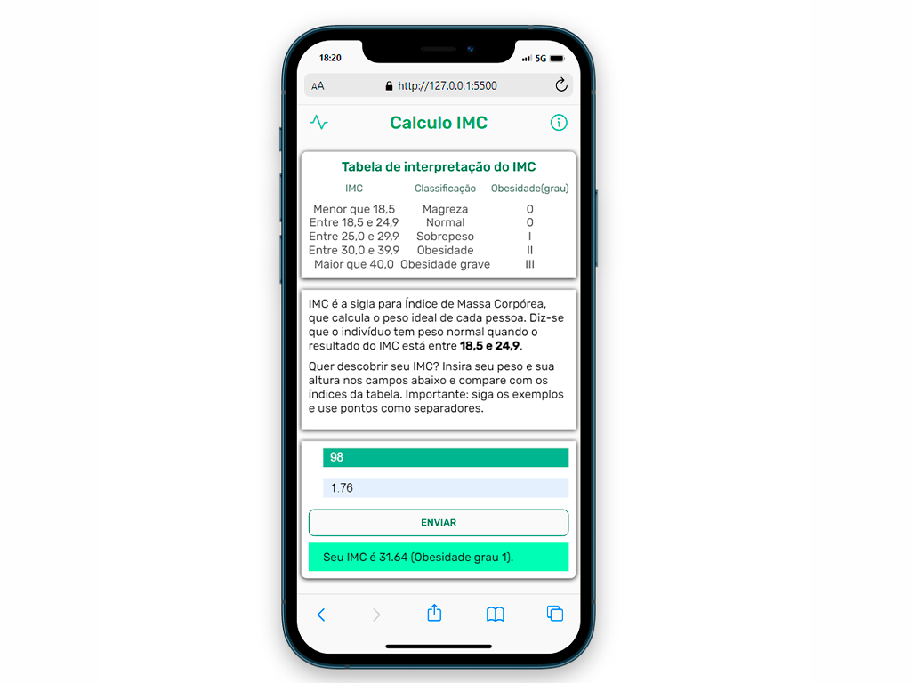

# Projeto Calculo IMC
## Assim ficou o projeto

  

## 🚀 Projeto feito com:

- HTML(semantica);
- CSS(para estilos);
- JavaScript(para interações);

## 📌 Desafio:

Tive um pouco de dificuldade para criar algumas intereações em JS, mas com o suporte do professor, aprendi bastante:
- Separar cada section em um bloco;
- Setar elementos na DOM, e trazê-los com resultado; 
- Ser responsivo;

## 🙋🏻‍♂️ Quem sou eu:

[@williamhenrique](https://www.linkedin.com/in/henriquewilliam/)
