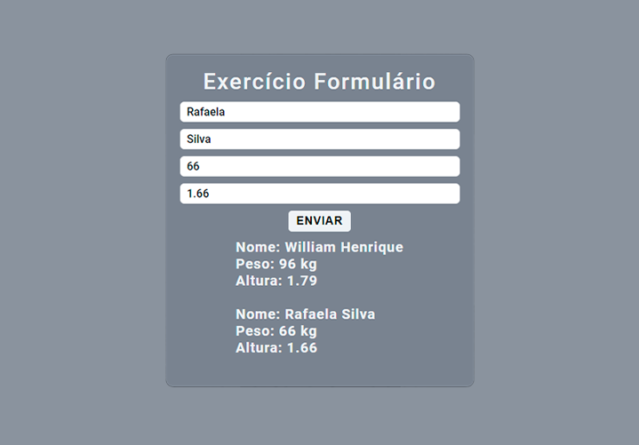

  Projeto desenvolvido a partir do Curso de JavaScript e TypeScript do básico ao avançado, 
  com o Professor Luiz Otávio Miranda. Nesta etapa aprendi a manipular alguns dados na DOM

Projeto desenvolvido com:

<ul>
  <li>HTML</li>
  <li>CSS</li>
  <li>JavaScrpt</li>
</ul>

  

